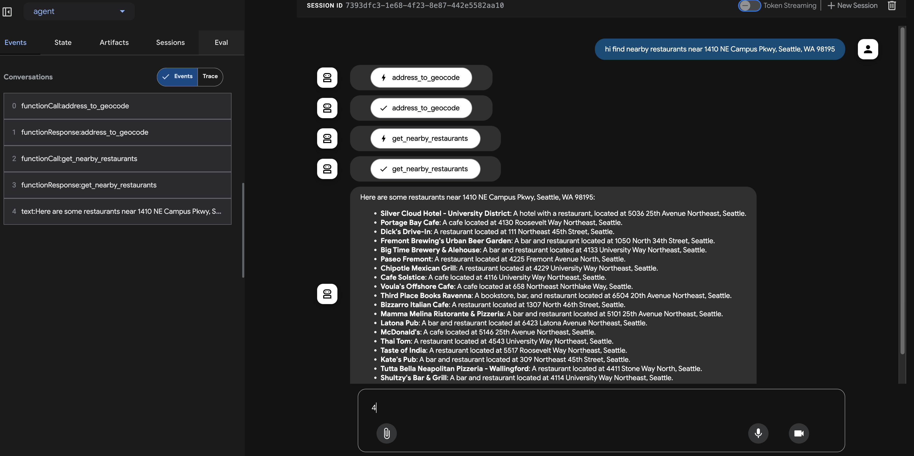

# nearby-restaurants-agent
An Agent that can help find nearby restaurants with an address using custom MCP servers.

Built by [Google Agent Development Kit](https://github.com/google/adk-python)

# Prerequisite

* Python3
* [uv](https://docs.astral.sh/uv/getting-started/installation/)

# How to run

* Create virtual env: `python3 -m venv ./venv`
* Activate venv: `source venv/bin/activate`
* Get [Google api key](https://cloud.google.com/docs/authentication/api-keys) and fill in `mcp_server/.env`
* Get [Vertex AI Api Key](https://google.github.io/adk-docs/get-started/quickstart/#set-up-the-model) and fill it in `sample_agent/agent/.env`, note this is different from the above api key. This one is generated from Vertex AI Studio while the above key is generated from Google Cloud Console for google map api access.
* Install dependencies: 
1. `pip install google-adk`
2. `cd mcp-server`
3. `uv pip install -r pyproject.toml`
4. `cd ../sample_agent`
5. Run `adk web`
6. Have fun!

# Screenshot:

# Reference
* [Google Agent Development Kit](https://github.com/google/adk-python)
* [Google Agent Development Kit Web](https://github.com/google/adk-web)
